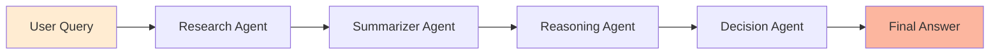

# 🤖 Multi-Agent AI System

<div align="center">


**نظام وكلاء ذكاء اصطناعي متعدد مع واجهة ويب عربية - A sophisticated multi-agent AI system with Arabic support**

[Features](#-features) • [Installation](#-installation) • [Usage](#-usage) • [Architecture](#-architecture) • [API](#-api-reference)

</div>

---

## 📖 Overview

Multi-Agent AI System is an intelligent question-answering platform that uses **four specialized AI agents** working in harmony to provide comprehensive, well-reasoned answers. Built with LangChain and powered by Google's Gemini 2.0 Flash, it processes queries through a sophisticated pipeline of research, summarization, reasoning, and decision-making.

### 🎯 What Makes It Special?

- **Four Specialized Agents**: Each with a specific role in the answer pipeline
- **Arabic Language Support**: Full RTL interface and Arabic processing
- **Flask Web Interface**: Beautiful, responsive design with gradient theme
- **RESTful API**: Easy integration with other applications
- **Orchestrated Workflow**: Agents work sequentially for optimal results
- **Google Gemini Powered**: Latest AI technology for accurate responses

---

## ✨ Features

### 🔍 **Four AI Agents**

#### 1️⃣ Research Agent (وكيل البحث)
- Gathers initial raw information
- Provides comprehensive, unfiltered data
- First stage of information processing

#### 2️⃣ Summarizer Agent (وكيل التلخيص)
- Distills research into key points
- Extracts essential information
- Reduces verbosity while preserving meaning

#### 3️⃣ Reasoning Agent (وكيل الاستنتاج)
- Analyzes summarized information
- Draws important conclusions
- Connects information to original query

#### 4️⃣ Decision Agent (وكيل القرار)
- Formats final answer clearly
- Ensures easy comprehension
- Delivers polished, professional response

### 🌐 **Web Interface**
- **Arabic RTL Support**: Full right-to-left layout
- **Beautiful Design**: Gradient background (Orange to Peach)
- **Responsive Layout**: Works on all devices
- **Real-time Processing**: Live status updates
- **Clean UX**: Simple, intuitive interface

### 🔌 **API Features**
- **RESTful Endpoint**: `/ask` POST endpoint
- **JSON Responses**: Structured data format
- **Error Handling**: Comprehensive error messages
- **Easy Integration**: Simple request/response pattern

---

## 🏗️ Architecture

### Agent Pipeline



### System Design

```
┌─────────────────────────────────────────┐
│           Flask Application             │
├─────────────────────────────────────────┤
│                                         │
│  ┌──────────────────────────────────┐  │
│  │      Orchestrator Layer          │  │
│  ├──────────────────────────────────┤  │
│  │                                  │  │
│  │  ┌────────────────────────────┐ │  │
│  │  │  1. Research Agent         │ │  │
│  │  │     (Raw Information)      │ │  │
│  │  └────────────────────────────┘ │  │
│  │              ↓                  │  │
│  │  ┌────────────────────────────┐ │  │
│  │  │  2. Summarizer Agent       │ │  │
│  │  │     (Key Points)           │ │  │
│  │  └────────────────────────────┘ │  │
│  │              ↓                  │  │
│  │  ┌────────────────────────────┐ │  │
│  │  │  3. Reasoning Agent        │ │  │
│  │  │     (Analysis)             │ │  │
│  │  └────────────────────────────┘ │  │
│  │              ↓                  │  │
│  │  ┌────────────────────────────┐ │  │
│  │  │  4. Decision Agent         │ │  │
│  │  │     (Final Format)         │ │  │
│  │  └────────────────────────────┘ │  │
│  │                                  │  │
│  └──────────────────────────────────┘  │
│                                         │
└─────────────────────────────────────────┘
              ▲
              │
    ┌─────────┴─────────┐
    │   Gemini 2.0 API  │
    └───────────────────┘
```

### Tech Stack

| Component | Technology |
|-----------|-----------|
| **Backend** | Flask 3.0+ |
| **AI Framework** | LangChain |
| **LLM** | Google Gemini 2.0 Flash |
| **Frontend** | HTML5 + CSS3 + JavaScript |
| **Language** | Arabic + English |
| **API** | RESTful JSON |

---

## 🚀 Installation

### Prerequisites

- Python 3.8 or higher
- Google Gemini API Key ([Get it here](https://makersuite.google.com/app/apikey))

### Step 1: Clone the Repository

```bash
git clone https://github.com/janaelpardisi/multi-agent-system.git
cd multi-agent-system
```

### Step 2: Create Virtual Environment

```bash
python -m venv venv

# On Windows
venv\Scripts\activate

# On macOS/Linux
source venv/bin/activate
```

### Step 3: Install Dependencies

```bash
pip install -r requirements.txt
```

### Step 4: Configure Environment

Create a `.env` file in the project root:

```env
GOOGLE_API_KEY=your_gemini_api_key_here
```

⚠️ **Important**: Never commit your `.env` file to version control!

Add this to your `.gitignore`:

```
.env
__pycache__/
*.pyc
venv/
.vscode/
*.log
```

---

## 💻 Usage

### Running the Web Application

```bash
python app.py
```

The application will start at `http://127.0.0.1:5050`

**Access the interface:**
- Open your browser
- Navigate to `http://localhost:5050`
- Enter your question in Arabic
- Click "Send" button
- Wait for the response

### Running the CLI Version

```bash
python multi_agents.py
```

**Customize the question:**

Edit the question in `multi_agents.py`:

```python
if __name__ == "__main__":
    question = "اكتب سؤالك هنا"  # Your question here
    result = multi_agent_system(question)
    print("Final Answer:", result)
```

---

## 📁 Project Structure

```
multi-agent-system/
│
├── app.py                  # Flask web application
├── multi_agents.py         # CLI version with orchestrator
├── requirements.txt        # Python dependencies
├── .env                    # Environment variables (not in repo)
├── .gitignore             # Git ignore file
├── README.md              # This file
│
└── templates/
    └── index.html         # Arabic web interface
```

---

## 🔧 Configuration

### Adjusting Agent Prompts

Each agent has customizable prompts in both files:

**In `multi_agents.py`:**

```python
def research_agent(query):
    prompt = f"""
انت Research Agent. ابحث عن معلومة مبدئية للاجابة عن السؤال التالي:
{query}
"""
    return llm.invoke([HumanMessage(content=prompt)]).content
```

**In `app.py`:**

```python
def run_agent(role, text):
    prompt = ChatPromptTemplate.from_messages([
        ("system", f"You are a {role} agent."),
        ("user", text)
    ])
    return llm.invoke(prompt.format_messages()).content
```

### Modifying LLM Parameters

```python
llm = ChatGoogleGenerativeAI(
    model="gemini-2.0-flash",
    temperature=0.3,  # Lower = more focused, Higher = more creative
    google_api_key=api_key
)
```

**Temperature Guide:**
- `0.0 - 0.3`: Focused, deterministic responses (Current)
- `0.4 - 0.7`: Balanced creativity and accuracy
- `0.8 - 1.0`: More creative and varied outputs

### Changing Server Port

In `app.py`:

```python
if __name__ == "__main__":
    app.run(host="127.0.0.1", port=5050, debug=True)
    # Change port to 8000, 3000, etc.
```

---

## 🔄 How It Works

### Processing Pipeline

1. **User Input**
   - User submits question via web interface or CLI
   - Query is passed to the orchestrator

2. **Research Agent** 🔍
   - Receives the original query
   - Gathers comprehensive raw information
   - Returns unfiltered research data

3. **Summarizer Agent** 📝
   - Takes research output
   - Extracts key points and essential information
   - Returns concise summary

4. **Reasoning Agent** 🧠
   - Analyzes the summary
   - Connects information to original query
   - Draws important conclusions

5. **Decision Agent** ✅
   - Formats the reasoning output
   - Ensures clarity and comprehension
   - Returns polished final answer

6. **Response Delivery**
   - Final answer displayed to user
   - JSON response for API calls

### Example Flow

```
Question: "ما هو دور الLSTM في الترجمة الآلية؟"

Research Agent → Raw data about LSTM and translation

Summarizer Agent → Key points: memory cells, sequence handling

Reasoning Agent → Analysis: Why LSTM works for translation

Decision Agent → Clear answer: LSTM role explained simply
```

---

## 🌐 API Reference

### POST `/ask`

Submit a question to the multi-agent system.

**Request:**

```bash
curl -X POST http://localhost:5050/ask \
  -H "Content-Type: application/json" \
  -d '{"query": "ما هو الذكاء الاصطناعي؟"}'
```

**Request Body:**

```json
{
  "query": "Your question here"
}
```

**Response (Success):**

```json
{
  "query": "ما هو الذكاء الاصطناعي؟",
  "answer": "الذكاء الاصطناعي هو..."
}
```

**Response (Error):**

```json
{
  "error": "please provide a query"
}
```

**Status Codes:**
- `200`: Success
- `400`: Bad Request (missing query)
- `500`: Internal Server Error

---

## 🎨 Customizing the UI

### Changing Colors

Edit the CSS in `templates/index.html`:

```css
/* Background gradient */
background: linear-gradient(to right, #ffecd2, #fcb69f);

/* Primary color */
color: #ff4081;

/* Button gradient */
background: linear-gradient(45deg, #ff4081, #ff80ab);
```

### Modifying Layout

```css
.container {
  max-width: 500px;  /* Change width */
  padding: 20px 25px;  /* Adjust padding */
}

textarea {
  height: 100px;  /* Adjust height */
}
```

---

## 🐛 Troubleshooting

### Common Issues

**Issue**: `ModuleNotFoundError: No module named 'langchain'`

**Solution**:
```bash
pip install -r requirements.txt
```

---

**Issue**: `API Key Error` or `Invalid API Key`

**Solution**:
- Ensure your `.env` file contains a valid `GOOGLE_API_KEY`
- Verify the key at [Google AI Studio](https://makersuite.google.com/)
- Make sure `.env` is in the root directory
- Restart the application after adding the key

---

**Issue**: `Port already in use`

**Solution**:
```bash
# Check what's using the port
netstat -ano | findstr :5050

# Change port in app.py
app.run(host="127.0.0.1", port=8080, debug=True)
```

---

**Issue**: Arabic text not displaying correctly

**Solution**:
- Ensure your browser supports Arabic fonts
- Check that the HTML has `lang="ar"` attribute
- Verify CSS has `direction: rtl` for Arabic elements

---

## 📊 Performance

### Response Times

- **Single Agent**: ~1-2 seconds
- **Full Pipeline (4 Agents)**: ~5-8 seconds
- **Network Latency**: Depends on connection to Google API

### Optimization Tips

1. **Reduce Temperature**: Lower temperature = faster responses
2. **Shorter Prompts**: Concise prompts process faster
3. **Caching**: Implement response caching for repeated queries
4. **Async Processing**: Use async/await for parallel operations

---

## 🤝 Contributing

Contributions are welcome! Here's how:

1. **Fork** the repository
2. **Create** a feature branch (`git checkout -b feature/NewFeature`)
3. **Commit** your changes (`git commit -m 'Add NewFeature'`)
4. **Push** to the branch (`git push origin feature/NewFeature`)
5. **Open** a Pull Request

### Ideas for Contribution

- [ ] Add English language support
- [ ] Implement conversation history
- [ ] Add database for storing queries/responses
- [ ] Create Docker containerization
- [ ] Add authentication system
- [ ] Implement rate limiting
- [ ] Add more specialized agents

---

## 📝 License

This project is licensed under the MIT License.

```
MIT License

Copyright (c) 2024 Jana Ashraf

Permission is hereby granted, free of charge, to any person obtaining a copy
of this software and associated documentation files (the "Software"), to deal
in the Software without restriction...
```

---

## 👨‍💻 Author

**Jana Ashraf**
- GitHub: [@janaelpardisi](https://github.com/janaelpardisi)
- LinkedIn: [Jana Ashraf](https://www.linkedin.com/in/jana-ashraf-elpardisi)

---

## 🙏 Acknowledgments

- [LangChain](https://langchain.com/) - For the AI framework
- [Google Gemini](https://deepmind.google/technologies/gemini/) - For the powerful LLM
- [Flask](https://flask.palletsprojects.com/) - For the web framework

---

## 📈 Roadmap

**Current Version**: v1.0

**Upcoming Features**:
- [ ] Multi-language support (English, French)
- [ ] Conversation memory/history
- [ ] Export answers to PDF/Word
- [ ] Voice input support
- [ ] Advanced agent customization
- [ ] Performance analytics dashboard
- [ ] Mobile app version

---

## 💡 Use Cases

### Education
- Student Q&A platform
- Research assistance
- Study guide generation

### Business
- Customer support automation
- Document analysis
- Decision support system

### Research
- Literature review assistance
- Data analysis interpretation
- Hypothesis testing

---

<div align="center">

**Made with Jana Ashraf ❤️ **

**صُنع بـ ❤️ والذكاء الاصطناعي**

[⬆ Back to Top](#-multi-agent-ai-system)

</div>
